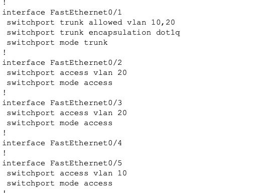
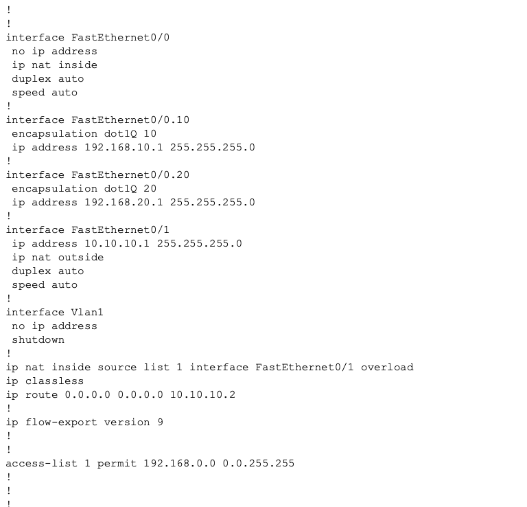
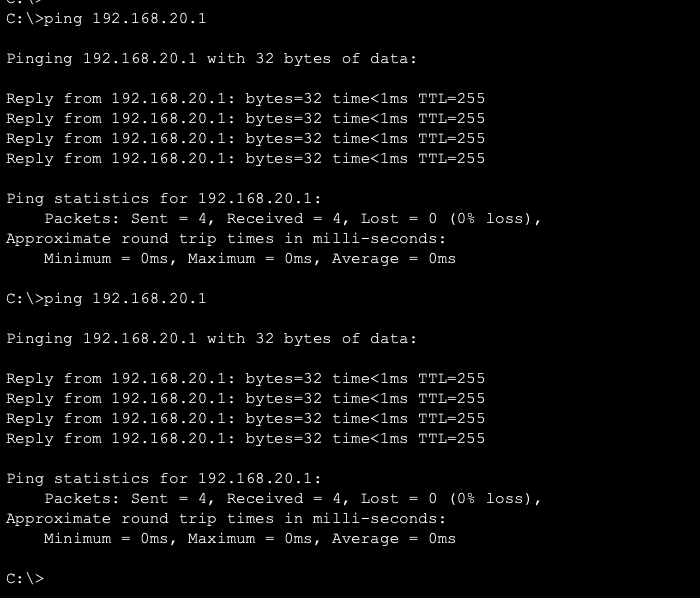
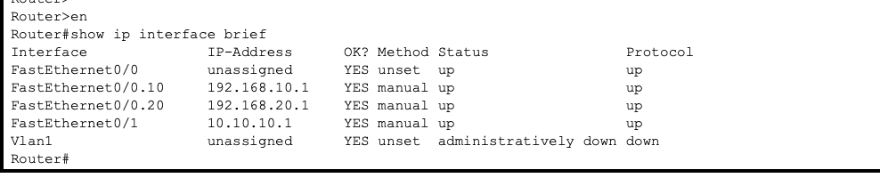
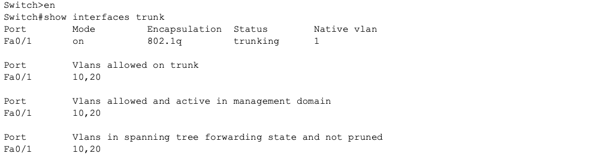
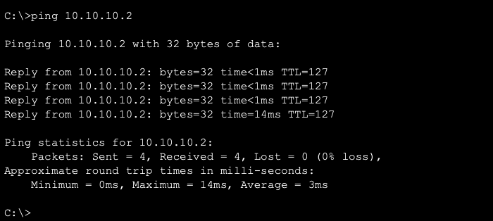
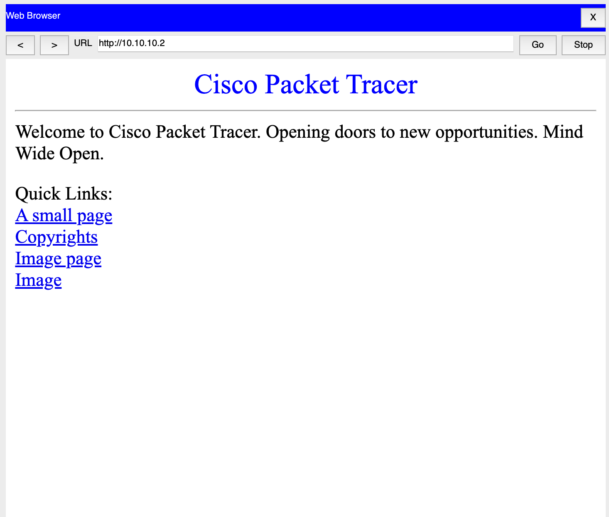
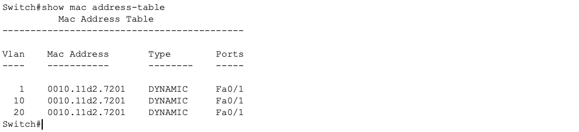

# 🏢 Small Business Enterprise Network Lab (VLANs, Routing, NAT, Internet Simulation)

This project simulates a **50-user small business network** built entirely from scratch using **Cisco Packet Tracer**.  
It demonstrates real enterprise networking concepts including:

- 🔹 VLAN segmentation  
- 🔹 Inter-VLAN routing (Router-on-a-Stick)  
- 🔹 Layer 2 vs Layer 3 design  
- 🔹 NAT overload (PAT)  
- 🔹 Default routing  
- 🔹 IP subnetting + addressing plan  
- 🔹 Testing against a mock “internet” server  

Although only a few hosts are physically shown for demonstration, the VLAN architecture supports **up to 254 hosts per VLAN**, providing full scalability for a 50–100 user office.

---

## 📡 **Network Overview**

### **Key Devices**
- Cisco **2811 Router** (FastEthernet-based)
- Cisco **3560-24PS Multilayer Switch**
- 3 PCs (representative clients)
- 1 Server acting as the simulated Internet

### **Core Features**
- VLAN 10 (Management)  
- VLAN 20 (Staff)  
- VLAN 30 (Guest) *(optional extension)*  
- 802.1Q trunk between Router ↔ Switch  
- NAT overload to reach external “internet”  
- Structured port layout and addressing plan  

---

## 🗺️ **Logical Network Diagram**


**Full Packet Tracer topology showing router, switch, VLANs, and host layout.**


---

## 🔐 **VLAN & Subnet Plan**

| VLAN | Name        | Subnet            | Purpose                          |
|------|-------------|-------------------|----------------------------------|
| 10   | Management  | 192.168.10.0/24   | Admin/IT workstations            |
| 20   | Staff       | 192.168.20.0/24   | Employee machines                |
| 30   | Guest       | 192.168.30.0/24   | Guest Wi-Fi (optional extension) |

Each subnet supports **254 users**, far surpassing typical small-business needs.

---

## 🔌 **Switch Configuration Summary**
### 📸 Switch Configuration Screenshot


**Full running configuration of the Cisco 3560 switch showing VLANs, access ports, and trunking.**


```bash
vlan 10
vlan 20

interface fa0/2
 switchport mode access
 switchport access vlan 20

interface fa0/3
 switchport mode access
 switchport access vlan 20

interface fa0/5
 switchport mode access
 switchport access vlan 10

interface fa0/1
 switchport trunk encapsulation dot1q
 switchport mode trunk
 switchport trunk allowed vlan 10,20
```
---

## 🚦 **Router Configuration (Router-on-a-Stick + NAT)**
### 📸 Router Configuration Screenshot


**Complete Cisco 2811 router configuration including dot1q subinterfaces, NAT overload, and routing.**

```bash
interface fa0/0
 no shut

interface fa0/0.10
 encapsulation dot1q 10
 ip address 192.168.10.1 255.255.255.0

interface fa0/0.20
 encapsulation dot1q 20
 ip address 192.168.20.1 255.255.255.0

interface fa0/1
 ip address 10.10.10.1 255.255.255.0
 no shut

access-list 1 permit 192.168.0.0 0.0.255.255
ip nat inside source list 1 interface fa0/1 overload

interface fa0/0
 ip nat inside

interface fa0/1
 ip nat outside

ip route 0.0.0.0 0.0.0.0 10.10.10.2
```
---

## 🧪 **Testing & Validation**
**Inter-VLAN Routing**


*PC in VLAN 20 successfully pinging gateway and host in VLAN 10, confirming inter-VLAN routing.*
From PC1 (192.168.20.11):
```
ping 192.168.20.1   # Router gateway
ping 192.168.10.11  # PC0 in VLAN 10
```
**Router Subinterfaces**


*Router subinterfaces Fa0/0.10 and Fa0/0.20 configured with correct dot1q tagging and gateway IPs.*

**Switch Trunk Status**


*Switch trunk interface Fa0/1 actively forwarding VLANs 10 and 20 using 802.1Q encapsulation.*

**NAT + Internet Simulation**

**Ping Test**

  
*PC successfully pinging simulated internet server (10.10.10.2).*


```
ping 10.10.10.2
```

**Browser Test**

  
*PC successfully reaching simulated internet server (10.10.10.2) via NAT overload.*


```
http://10.10.10.2
```
**Mac address table**

*Switch dynamically learning MAC addresses across VLANs, confirming correct Layer 2 operation.*

---

## 📘 Lessons Learned

- The importance of verifying physical cabling before troubleshooting logical issues  
- How trunk ports differ from access ports and why VLAN mismatches break connectivity  
- Why router subinterfaces must match the switch’s allowed VLAN list  
- How NAT inside/outside roles impact external connectivity  
- How to use `show mac address-table` and `show interfaces trunk` to isolate problems  
- The value of documenting IP addressing and port mappings early  
- How small misconfigurations (like wrong access mode) can cascade into major outages  

## 🚀 Future Enhancements

- Add DHCP pools for all VLANs  
- Configure ACLs to restrict Guest VLAN to internet-only  
- Add a wireless access point and SSID mapping to VLAN 30  
- Introduce a firewall between router and “internet” server  
- Add a second switch to simulate multi-floor office distribution  
- Build an Ansible playbook to automate switch and router provisioning  
- Convert Packet Tracer lab to GNS3 or CML for more realism  
- Add monitoring (SNMP, syslog) for network visibility

- ---

## 📬 Contact
If you’d like to connect or discuss this project:

**LinkedIn:** https://www.linkedin.com/in/imani-marsden-134b0678/  
**GitHub:** https://github.com/Mars-Node


